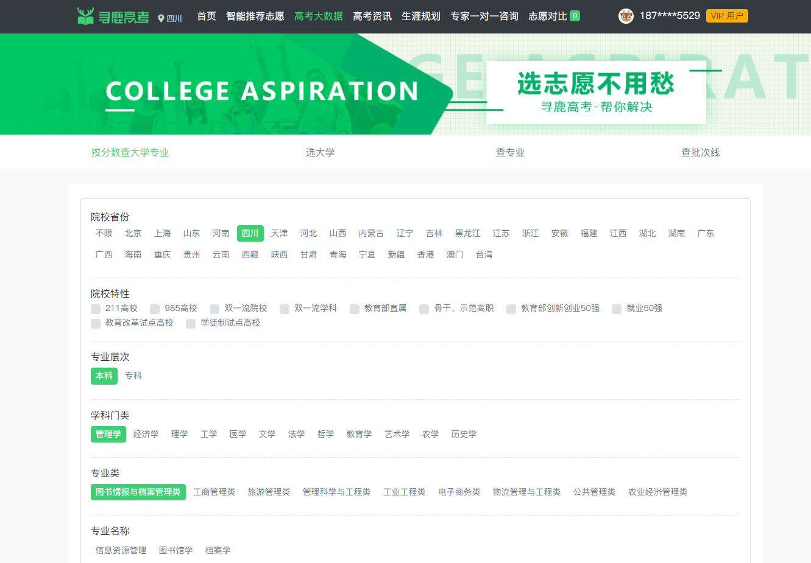
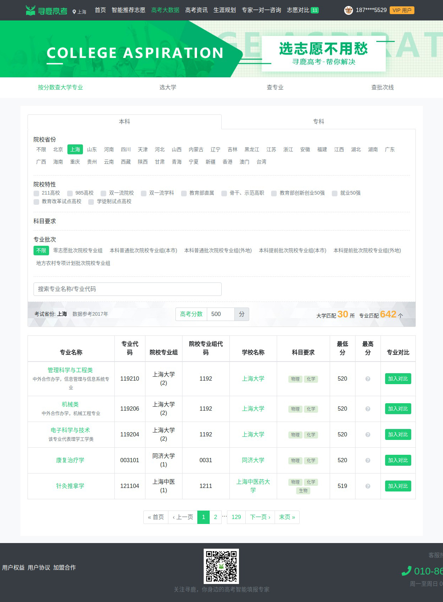

# 高考大数据

#### 用户可以通过多个维度自助查询，并将感兴趣的专业志愿加入对比

### 1.老高考——基础查询

1.按分数查询报考专业；  2.按专业类查询；  3.按院校查询；  4.按批次线查询

### 2.新高考（上海）——高级查询

1.按学科类别查询\(物理、化学、生物等）；  2.按就业数据查询（薪酬、就业地区、就业行业）

3.按男女比例查询；  4.按专业对口度查询；  5.按学校满意度查询

