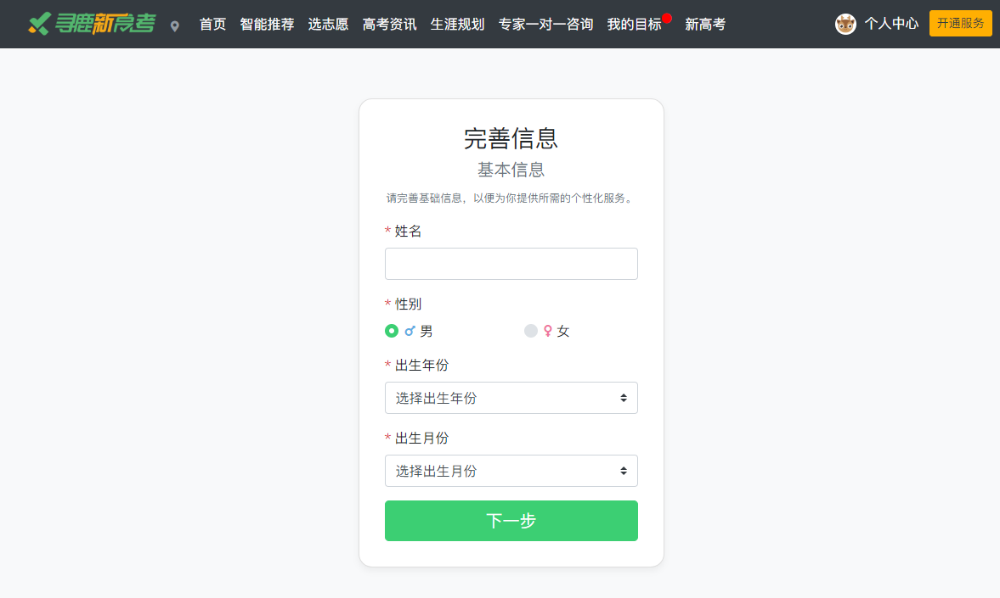
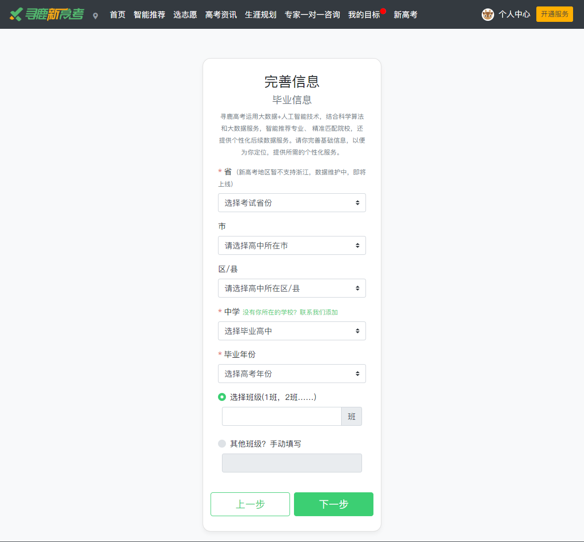
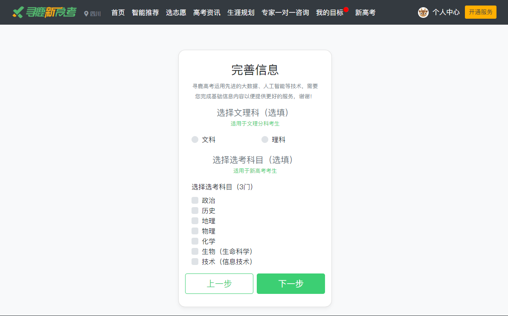

# 登陆与完善基本信息

## 一、**首次登录**

### 1.登录界面输入手机号码及密码

### 2.完善个人基础信息

    1.所属省份

    2.毕业高中

    3.毕业年份

    4.所属学科

### 3.确认提交

## 二、完善基础信息

说明：用户在填写录入带 \* 号必填基础信息，提交后该信息将无法更改。 \(  请谨慎填写  \)

## 三、毕业信息完善

## 四、选填信息

### 

